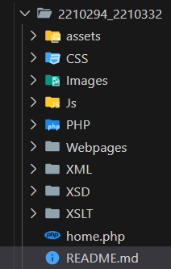

## DGT 2034Y - Internet Technologies and Web Services

- Project by:
    - ***Doollah Adeetya - 2210294***
    - ***Soobedar Bibi Aqsaa - 2210332***

###### *Note: We recommend using this extension to preview this markdown file in VS code Studio or you can go with one of your choice. We have also attached a PDF version of this mark down file in the main folder, you may refer to it as well.*


### contents:
``` markdown
- Intro
- Pages/Folder Tree
- Getting started 101
- Creating the Database
- Creating the tables & Pre-filled data
- Acessing the Website
- Admin interface
- Enjoy! 
```

### 1. Intro
This is our 2nd year project for semester 1 of module 2034Y - Internet Technologies and Web Services at University of Mauritius. We have created a website for a photography startup - '**TakeTwo**' where we provide photography services to our customers which can register, contact, buy and view from the web interface. This project is a mix of various technologies learned throughout the course and explored from the web.

### 2. Pages/Folder Tree
``` markdown
Below is the folder structure of the project:
- Index page aka our 'home.php' - It found in the main folder '2210294_2210332'
- All webpages are found in '../Webpages/'
- All PHP logic and processing are found in '../PHP/'
- All images are organised in sub-folders wuthin '../Images/'
- XML, XSD, XSLT files are within their related folders.
- All other related folders contains the relative files/folders needed.
- Only the 'assets' folder is not being in use, we have kept it for future work.
```


### 3. Getting started 101

You would need access to a web server/localhost to be able to access and view the project in your preferred browser. Feel free to use the setting of your choice.
**Note:** Due to hardware incompatibilities, we have used ***PHP 5.3***  to make this project. We have come across several issues whereby we have not been able to use code compatible with *PHP > 5.3* which some work go a bit off track.

### 4. Creating the database 
``` markdown
We have used MySQL to create the database and support the project.
We recommend using MySQL to avoid any code incompatibility issues 
when continuing further.

1. To access MySQL, you can use phpMyAdmin from your webserver.
2. Create a new database named 'TakeTwo'
3. Refer to the image below if needed.
```


### 5. Creating the tables & Pre-filled data
``` markdown
1. Navigate the folder Structure and locate the 'PHP' folder
2. Within the 'PHP folder', locate the 4 highlighted files as shown below:
   (Hint: they all start with 'db_xyz.php')
        > db_admin.php
        > db_files.php
        > db_forms.php
        > db_loginRegister.php
```

``` markdown
3. Open the files and you should see something like this:
    > "Tables created. Insertion successful"
4. Open all 4 files and you should be good to go.
5. In total, you should have 6 tables created.
6. All tables have pre-filled data for demo purposes.
```

### 6. Acessing the Website
``` markdown
Access the website via the home page 'home.php'
You can find it in the main folder along with the README file.
```

``` markdown
Feel free to browse the webpages and view the contents. 
Some pages are only accessible after login, you can register a new user
Or use the credentials of a current user which you can find in the table 'client'.
```
### 7. Admin interface
``` markdown
To view admin data, accessible only to an admin, follow these steps:
1. login to the admin section (Accessible via the footer link only).
2. Enter any one of the login credentials of the 2 admins below:
```

``` markdown 
3. Click out of the input box.
4. The login button should appear via AJAX response upon credential validation.
5. Within the admin page, use the drop-down menu to view Data.
6. You can view information about the pre-filled data.
7. User get acess to only user accesible parts of the website via their login 
   session.
8. Admin have full website access and priviledge.
```
### 8. Enjoy !

You now have the website setup and functioning, feel free to browse the website and leave a nice review on our work.
Thank you.